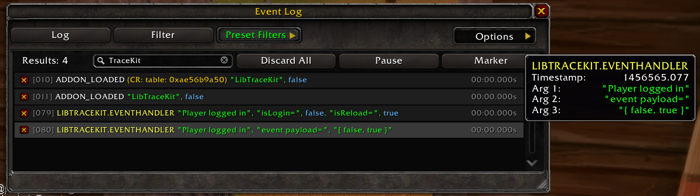
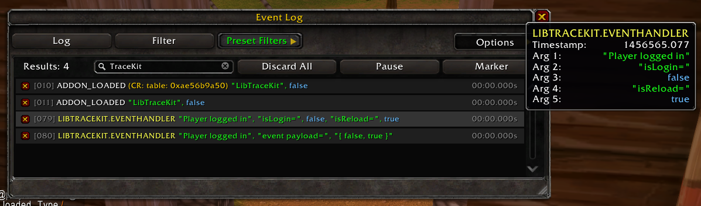

# LibTraceKit
> ▶︎ _Because scrolling through 200 lines of print() is not a debugging strategy._

_LibTraceKit_ is a lightweight tracing library for WoW addon developers. Create a tagged tracer with `TraceKit('<Addon Name>')` and call it like a function to send labeled debug messages to Blizzard's Event Trace UI.

Rather than scattering `print()` calls through your addon or maintaining a separate debug log, _LibTraceKit_ routes your trace output straight into `/etrace` — so your custom messages appear interleaved with real game events, in the correct time order, in one place. Tagging each tracer by addon or module name keeps output readable even when multiple addons are tracing at once.

Create the tracer once, then call it anywhere like a regular function — no manual event registration, no formatting boilerplate.

## Usage

`LibTraceKit:New(namespace, hexColor)` returns a `TraceKit_MultiFunction-1.0` instance, which is fluent: its `With*` methods configure the tracer and return `self`, so calls can be chained directly off `New()`. Use `WithTag(tag)` to label a tracer by module or subsystem, and `WithDelimiter(delim)` (or the `WithUnderscoreDelimiter()` shortcut) to override how the namespace and tag are joined in the trace output (default `::`).

`New()` also returns a second, optional value: `fmt`, a formatter you can use to pretty-print tables and other complex values before passing them to the tracer.

```lua
--- @type LibTraceKit-1.0
local LibTraceKit = LibStub('LibTraceKit-1.0')

--- @type TraceKit_MultiFunction-1.0, LibTraceKit_Formatter-1.0 
local t, fmt = LibTraceKit:New('libtracekit', '29FFEF')
```

### Examples using fluent functions (Preferred)

Chain `With*` methods off `New()` to override defaults — tag, color, and delimiter — without passing everything as positional args up front.

```lua
--- @type TraceKit_MultiFunction-1.0 
local t = LibTraceKit:New('libtracekit')
                  :WithTag('Main'):WithUnderscoreDelimiter()

--- @type TraceKit_MultiFunction-1.0 
local t = LibTraceKit:New('libtracekit')
                  :WithTag('EventHandler')
                  :WithColor('FF9C8C') 
                  -- OR use the blizzard predefined color vars
                  -- :WithColor(RARE_BLUE_COLOR)
                  :WithDelimiter('.')
```

### Tracing Simple Variables

Call the tracer like a plain function, passing a label followed by any number of values — they show up together as one entry in `/etrace`.

The returned `t` is both things at once: it's the `TraceKit_MultiFunction-1.0` instance returned by `New()` (or `WithTag`/`WithDelimiter`), and it's directly callable as a trace function. There's no separate object to unwrap — the same `t` you configure with `:WithTag(...)` is the `t(...)` you call to trace.

```lua
local isLogIn, isReload = ...
t('Player logged in', 'isLogin=', isLogIn, 'isReload=', isReload)
```



### Tracing Complex Variables

For tables or other complex values, wrap the argument in `fmt(...)` — backed by [LibPrettyPrint](https://github.com/kapresoft/wow-addon-LibPrettyPrint) — so it prints as a readable structure instead of a raw table reference.

```lua
--- @type TraceKit_MultiFunction-1.0, LibTraceKit_Formatter-1.0 
local t, fmt = LibTraceKit:New('libtracekit', '29FFEF')
t('Player logged in', 'event payload=', fmt({...}))
```


### More Examples

```lua
-- prints a table hash of spellInfo
t('Spell casted', 'spell=', spell, 'spellInfo=', spellInfo)

-- prints a formatted spellInfo (to-string)
t('Spell casted', 'spell=', spell, 'spellInfo=', fmt(spellInfo))
```

### Alternative: Creating a Plain Trace Function

If you don't need the fluent `With*` methods, `CreateTraceFunction` takes all settings up front and returns a plain function instead of a `TraceKit_MultiFunction-1.0` instance.

```lua
local t, fmt = LibTraceKit.CreateTraceFunction('MyAddOn', 'MainController', RARE_BLUE_COLOR, '_')
t('Player logged in', 'isLogin=', isLogIn, 'isReload=', isReload)
```

Or skip the color and delimiter entirely and let them fall back to the defaults:

```lua
local t, fmt = LibTraceKit.CreateTraceFunction('MyAddOn', 'MainController')
t('Player logged in', 'isLogin=', isLogIn, 'isReload=', isReload)
```

## License
All Rights Reserved.

